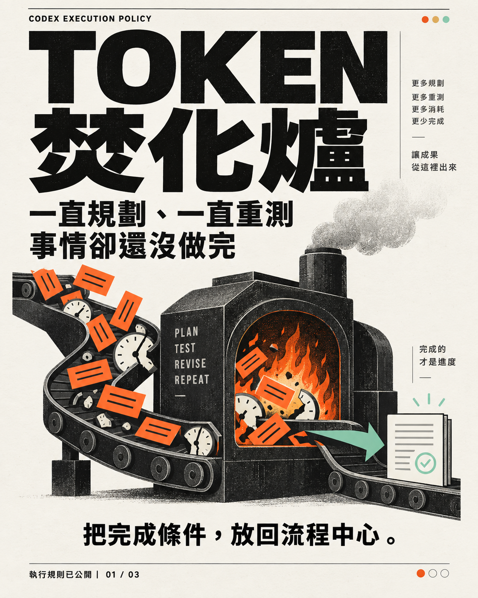
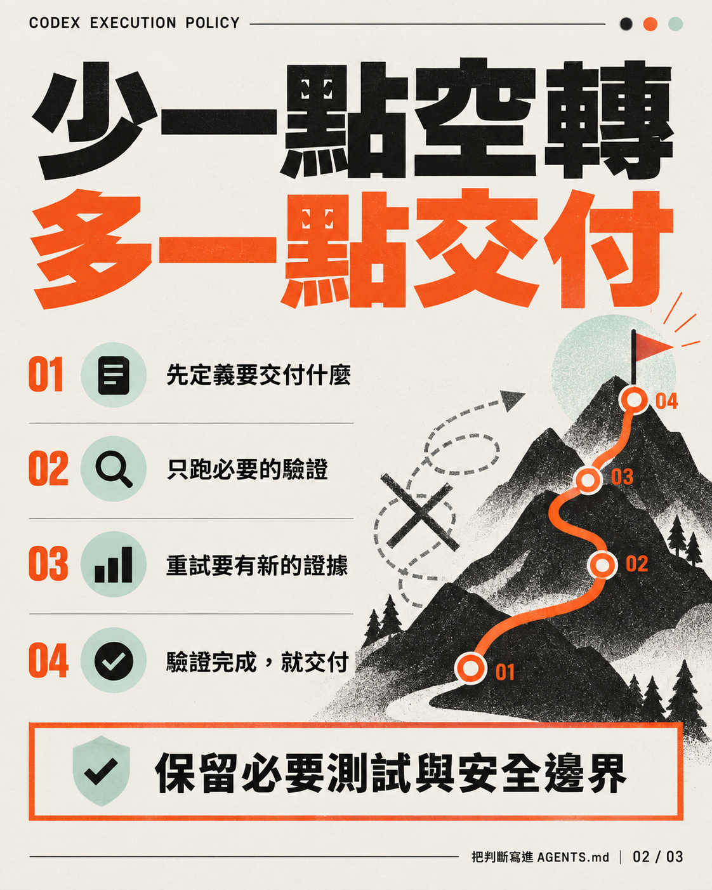
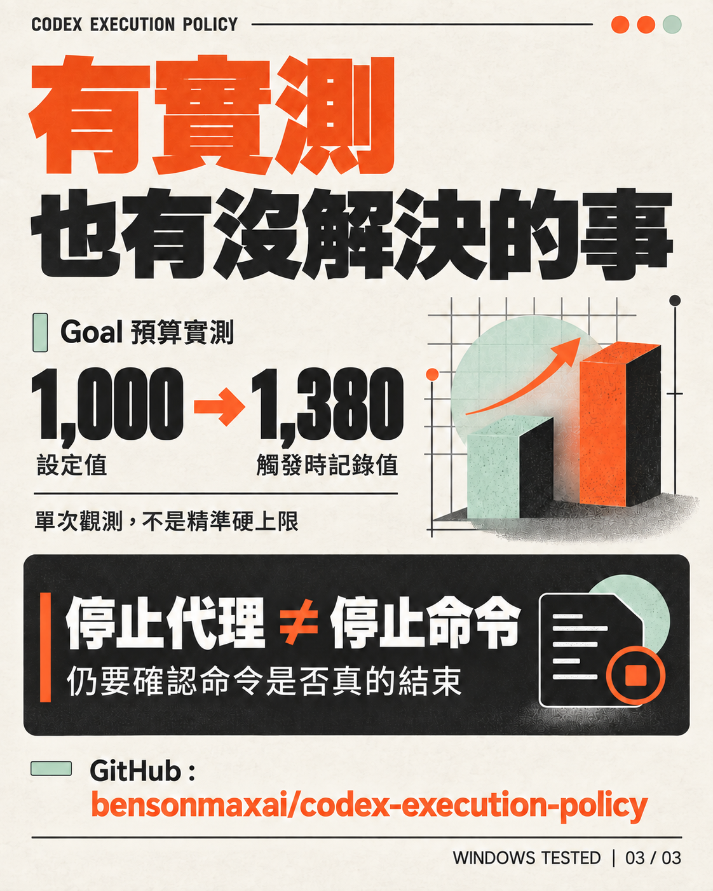
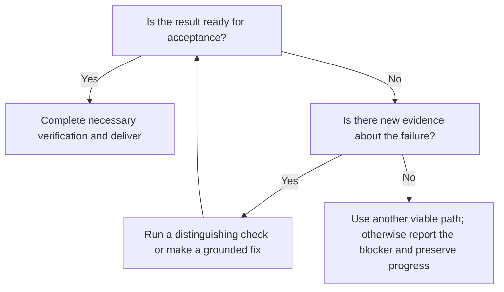

# TOKEN FURNACE

[繁體中文](README.md) | **English**

### Codex Execution Policy: Keep execution focused on the result

Codex can spend tokens on repeated planning, repairing prerequisites it does not need, retrying without new evidence, or continuing to check work after the result is ready. This **lightweight AGENTS execution policy** makes the decision points explicit: identify an observable outcome, take the shortest supported path, keep the necessary verification, and deliver when the work is done.

These are local working rules that can be selectively merged into Codex environments on Windows, macOS, or Linux. They are **not a plugin, an installer, or a hard token or billing limit**. The wording is portable, but each machine's effective rule location and runtime capabilities must be checked locally. The policy does not replace existing permission, safety, model, tool, skill, or business workflow rules.

<p align="center">
  
  
  
</p>

The original artwork is in Traditional Chinese; the key points are explained below.

## What to do when execution stalls

| Common pattern | Action |
| --- | --- |
| Writing a long plan or checklist before a small task | Identify the observable result and start. Use native planning and tools for routine work; add persistent tracking only when the task needs it. |
| Repairing a failed prerequisite indefinitely | First determine whether that capability is needed to deliver. If it is, check the actual entry point and version before repairing it. |
| Retrying the same failed path | Retry only when a new observation supports a different next action and a check can distinguish the cause. Otherwise use another supported path or report the blocker clearly. |
| Repeating a full test suite after valid verification | Choose tests according to the change and risk. Reuse evidence when the relevant code, inputs, and environment are unchanged, while still checking current external state and the actual result. |
| Adding unrelated work after the result is ready | Deliver after the necessary verification. Do not append improvements or review rounds that were not requested. |



Read [POLICY.md](POLICY.md) for the operative rules. The table and flowchart are reading aids; the policy file governs if wording differs.

## What was tested?

The rules were deployed on Windows on 2026-09-23, and the validation record was compiled on 2026-09-24. These are **one-off isolated tests and deployment evidence**, not long-term performance statistics. See [VALIDATION.md](VALIDATION.md) for details and limitations; that record is currently in Traditional Chinese.

| Item | Observation | Limit of the evidence |
| --- | --- | --- |
| Rule deployment | Only the Coding Discipline and Lean Native Execution sections of the global AGENTS file changed. A backup, hashes, and a complete readback confirmed that everything outside those sections remained byte-for-byte identical. | Applied on Windows; this does not show that every existing task refreshed its rules. |
| Small CSV fix | The specified program's four existing tests went from two failures to all passing. Tests and unrelated files were unchanged. | One synthetic case cannot establish a fixed savings rate. |
| Native Goal budget | With a **1,000-token** setting, an intermediate reading showed 772 tokens. A later `budget_limited` notification reported **1,380 tokens in 6 seconds**, and the agent stopped substantive work. | This exceeded the setting by 380 tokens. It is not a precise hard cap or billing cap, and it did not prove a limit across the whole agent tree. |
| Agent interruption | The agent showed `interrupted`, but its command logged four more heartbeats and exited naturally after about 45 seconds. | Interrupting an agent does not automatically cancel its command. Check known child work separately when stopping a task. |
| Direct PTY command cancellation | The controller sent Ctrl-C through native `write_stdin`; after about 17 seconds it received `KeyboardInterrupt` / exit 1. Heartbeats stopped and the process was gone. | This cancellation path worked in the test; it does not prove that all tools or descendant processes behave the same way. |
| macOS and Linux | Neither platform has been deployed to or validated. | Selective merging is possible, but Goal, budget notification, and cancellation capabilities require local checks. Windows results do not establish their behavior elsewhere. |

There is no long-term evidence from natural tasks yet, so this project does not claim a particular percentage, token count, or cost saving. Necessary safety, identity, authorization, and outcome checks remain required.

## Copy-paste brief for another local Codex environment

Use this in an **authorized local Codex task on Windows, macOS, or Linux**. Its scope is a selective merge of the policy:

```text
Goal: Selectively merge the execution rules in POLICY.md into the effective AGENTS rules for this supported local Codex environment.
Context: Project: https://github.com/bensonmaxai/codex-execution-policy. Read POLICY.md and VALIDATION.md first. These are portable working rules, but only Windows deployment and runtime behavior have been tested. macOS and Linux remain unvalidated, and the Windows capability results cannot be assumed elsewhere.
Constraints: Locate this machine's actual Codex home and effective AGENTS file; do not assume a path. Check existing rules and any required local review. Preserve current safety, permission, model, Skills, tool routing, business workflow, and config rules. Reuse equivalent rules, do not overwrite the whole file, and do not install anything extra. Back up the file and check for drift before editing. Change only the authorized sections, then read the file back and verify the diff. Do not create a synthetic task or Goal just for validation. Test cancellation only if an existing, isolated, authorized, safe target is available; otherwise mark it unverified.
Done when: The specified sections are merged, all other content is preserved, and the backup and diff can be checked. Report evidence that the rules actually loaded, this environment's runtime capabilities, and any unverified boundaries. Observe the effect later through work that was already going to be done.
```

To roll back, reverse only this change. If the file has changed again since deployment, inspect the diff first; do not overwrite the whole file with an old backup.

## Public scope

This repository's public materials are limited to the Traditional Chinese [README.md](README.md), English [README.en.md](README.en.md), [POLICY.md](POLICY.md), [VALIDATION.md](VALIDATION.md), and reviewed public artwork. Do not add a complete global AGENTS file, backups, config, account information, raw task logs, or local runtime artifacts.
