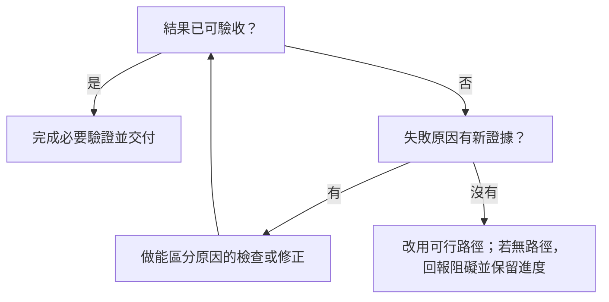

# TOKEN 焚化爐

**繁體中文** | [English](README.en.md)

### Codex Execution Policy：讓執行回到交付本身

Codex 有時會把 token 花在重複規劃、修理非必要前置條件、沒有新證據的重試，或結果已經完成後繼續加做檢查。這份**輕量 AGENTS 執行原則**把判斷寫清楚：先抓住可驗收的結果，走最短的可行路徑，保留必要驗證，完成後就交付。

它是一份可在 Windows、macOS、Linux 的本機 Codex 環境中局部整併的工作規則，**不是 Plugin、安裝器或 token／帳單硬上限**。規則文字可移植，但實際生效位置與 runtime 能力要在各台機器核對；它不取代原有的權限、安全、模型、工具、技能與業務流程規則。

<p align="center">
  
  
  
</p>

## 遇到這些狀況，怎麼做？

| 常見執行模式 | 對應動作 |
| --- | --- |
| 小工作先寫長計畫、清單，才開始處理 | 直接確認可驗收結果；日常工作使用原生規劃與工具，只有任務真的需要時才留下額外追蹤。 |
| 前置工具失敗後，持續修理它 | 先確認該能力是否為交付所必需；必要時檢查實際執行入口與版本，再處理故障。 |
| 同一條失敗路徑反覆重試 | 每次重試都要有新觀察與能區分原因的檢查；沒有新證據，就換可用路徑或清楚回報阻礙。 |
| 已有有效驗證，仍重跑整套檢查 | 依變更與風險選擇測試；程式、輸入與環境未變時沿用仍有效的證據，但目前的外部狀態和實際結果仍須查核。 |
| 結果已可交付，繼續補做無關項目 | 完成必要驗證後交付；不追加未要求的改善或審查。 |



完整文字見 [POLICY.md](POLICY.md)；上表與流程圖是閱讀導引，以該檔為準。

## 實測到哪裡？

2026-09-23 在 Windows 部署，2026-09-24 彙整驗證。以下是**單次隔離測試與部署證據**，不是長期效能統計；細節與限制見 [VALIDATION.md](VALIDATION.md)。

| 項目 | 觀察結果 | 解讀界線 |
| --- | --- | --- |
| 規則部署 | 只修改全域 AGENTS 的 Coding Discipline 與 Lean Native Execution；備份、雜湊及寫後回讀核對，其他內容逐位元組相同。 | Windows 已套用；不代表其他既有任務都已刷新規則。 |
| 小型 CSV 修正 | 指定程式的既有 4 項測試由 2 項失敗變為全過，測試與無關檔案未改。 | 單次合成案例，不能換算固定節省幅度。 |
| 原生 Goal 預算 | 設定 **1,000 tokens**；代理在 772 tokens 後，收到 **1,380 tokens／6 秒**的 `budget_limited` 訊息並停止實質工作。 | 超過設定值 380 tokens；這不是精準硬上限或帳單上限，也未證明能限制整棵代理工作樹。 |
| 中斷代理 | 代理顯示 `interrupted`，它啟動的命令仍增加 4 次心跳，約 45 秒後自行結束。 | 停止代理不等於連帶取消命令；取消時要分別核對已知子工作。 |
| 直接取消 PTY 命令 | 主控透過原生 `write_stdin` 傳 Ctrl-C，約 17 秒收到 `KeyboardInterrupt`／exit 1，心跳停止且程序不存在。 | 此路徑實測可取消；不能推論所有工具或孫程序都相同。 |
| macOS／Linux | 尚未部署或驗證。 | 規則可供局部整併；Goal、預算通知與取消等 runtime 能力須以當地實測為準，不沿用 Windows 結論。 |

目前尚無自然任務的長期成效數據，因此不宣稱省下特定百分比、token 或費用。必要的安全、身分、授權與結果查核仍要做。

## 給另一個本機 Codex 環境的工作單

以下可複製到**已授權的 Windows、macOS 或 Linux 本機 Codex 任務**，執行範圍只限局部整併：

```text
Goal: 在目前支援的本機 Codex 環境中，將 POLICY.md 的執行原則局部整併到實際生效的 AGENTS 規則。
Context: 專案網址 https://github.com/bensonmaxai/codex-execution-policy 。先讀 POLICY.md 與 VALIDATION.md。這是跨平台可參考的輕量工作規則；目前只有 Windows 部署與 runtime 實測，macOS、Linux 尚未驗證，其他環境也不能直接沿用該能力結論。
Constraints: 先找出這台機器實際的 Codex home 與生效 AGENTS，不預設路徑；核對既有規則及必要的本機審查要求。保留原有安全、權限、模型、Skills、工具路由、業務流程與 config；等效規則沿用，不覆蓋整份檔案，也不安裝額外項目。修改前備份並檢查檔案漂移；只改獲授權的指定段落，寫後回讀並核對差異。不為驗證另建合成任務或 Goal；僅在現成、隔離、已授權的安全目標存在時測取消，否則記為未驗證。
Done when: 指定段落已整併，其他內容保留，備份與差異可核對；回報規則實際載入證據、此環境的 runtime 能力及尚未驗證的邊界。後續用原本要做的工作觀察成效。
```

若需回復，只反向還原這次修改；若檔案後來又有變動，先核對差異，不用舊備份覆蓋整份檔案。

## 公開範圍

此儲存庫公開的材料限繁體中文 [README.md](README.md)、英文 [README.en.md](README.en.md)、[POLICY.md](POLICY.md)、[VALIDATION.md](VALIDATION.md) 與審過內容的公開圖片素材。不要加入完整全域 AGENTS、備份、config、帳號資訊、原始任務紀錄或本機 runtime 產物。
